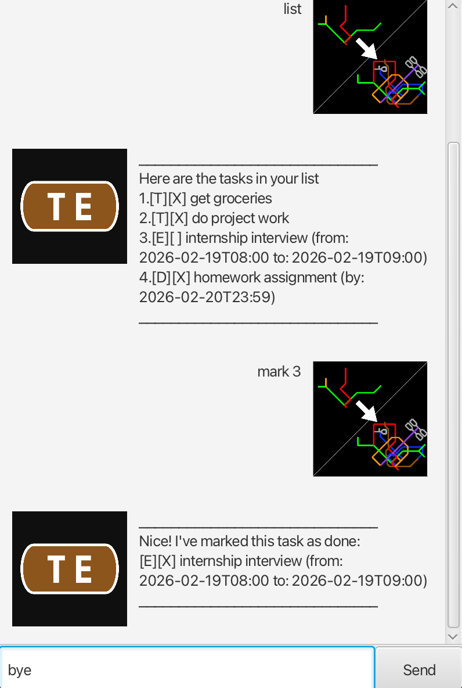

# Tel User Guide



Tel is a little program that serves as your personal to-do list.

It is named after my YouTube channel, [**T**ransit **E**vo**L**ution](https://www.youtube.com/@transitevolution), which itself has a channel logo inspired from the brown caplet of the [**T**homson - **E**ast Coast MRT **L**ine](https://en.wikipedia.org/wiki/Thomson–East_Coast_Line). 🚇

> Thank you for your kind support. I have just reached 8000 subscribers!
> – Jia Cheng, 6 Feb 2026

**Tel handles 3 types of tasks:**
1. Deadlines
2. Events
3. To-Dos

**With this program, you can:**
- Add tasks
- Delete tasks
- Find tasks
- List tasks
- Update tasks

**You can also...**
- [x] Mark task as done
- [ ] Unmark task as undone

### **Using this program is easy! Commands are listed below.**

## Exit the program
Use the "bye" command to save the todo list in a file and exit the program!
Input: `bye`

## Create deadline
Use the "deadline" command to create a task with a name, and a deadline!
The /by flag separates the name of the task with the deadline.
Input: `deadline Assignment /by 2026-02-02 22:22`
Output:
```
Got it. I've added this task:
[D][] Assignment (by: 2026-02-02T22:22)
Now you have 5 tasks in the list.
```

## Delete task
Use the "delete" command to delete the nth task!
Input: `delete 5`
Output:
```
Noted. I've removed this task:
[D][] Assignment (by: 2026-02-02T22:22)
Now you have 4 tasks in the list.
```

## Create event
Use the "event" command to create an event with a name, start time, and end time!
The /from and /to flag separates the name of the task, with the start time, and the end time.
Input: `event Meeting /from 2026-02-02 18:00 /to 2026-02-02 20:20`
Output:
```
Got it. I've added this task:
[E][] Meeting (from: 2026-02-02T18:00 to: 2026-02-02T20:20)
Now you have 5 tasks in the list.
```

## Find event
Use the "find" command to find an event using a search keyword!
Input: `find project work`
Output:
```
Here are the matching tasks in your list
1.[T][X] do project work
```

## List event
Use the "list" command to list all events in your to-do list!
Input: `list`
Output:
```
Here are the tasks in your list
1.[T][X] get groceries
2.[T][X] do project work
3.[E][X] internship interview (from: 2026-02-19T08:00 to: 2026-02-19T09:00)
4.[D][X] homework assignment (by: 2026-02-20T23:59)
5.[E][] Meeting (from: 2026-02-02T18:00 to 2026-02-02T2020)
```

## Mark event
Use the "mark" command to mark the nth event as done!
Input: `mark 5`
Output:
```
Nice! I've marked this task as done:
[E][X] Meeting (from:2026-02-02T18:00 to: 2026-02-02T20:20)
```

## Create todo
Use the "todo" command to create a task with a name, but without a deadline!
Input: `todo Laundry`
Output:
```
Got it. I've added this task:
[T][] Laundry
Now you have 6 tasks in the list.
```

## Unmark event
Use the "unmark" command to mark the nth event as not done!
Input: `unmark 5`
Output:
```
OK, I've marked this task as not done yet:
[E][] Meeting (from:2026-02-02T18:00 to: 2026-02-02T20:20)
```